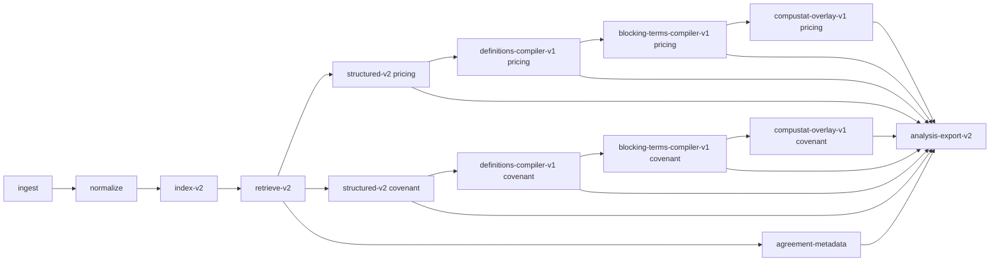

# Pipeline Map (Locked Recursive Workflow)

This repository now has one supported extraction flow.

## Stage graph

## Canonical orchestrator

- `pipeline all-v2-full`

The full orchestrator is the only supported batch flow. It enforces the strict recursive methodology for pricing and covenant outputs before export.

## Artifact contract

- `runs/<run_id>/indexing_v2/<item_id>_anchors.json`
- `runs/<run_id>/retrieval_v2/<item_id>_snippets.jsonl`
- `runs/<run_id>/llm_qa/<subdir>/<item_id>.json`
- `runs/<run_id>/definitions_compiler_v1/<subdir>/<item_id>__compiled.json`
- `runs/<run_id>/blocking_terms_compiler_v1/<subdir>/<item_id>__compiled.json`
- `runs/<run_id>/compustat_overlay_v1/<subdir>/<item_id>__compustat_overlay.json`
- `runs/<run_id>/agreement_metadata/<subdir>/<item_id>.json`
- `runs/<run_id>/analysis_export/analysis_export_v2/<item_id>.json`
- `runs/<run_id>/analysis_export/analysis_export_v2/records.jsonl`

## Retired workflows

Retired and unsupported in the codebase:

- `toc-v1`
- `definitions-v2`
- `analysis-export` (v1)
- `contract-pricing*`
- `contractir-v0-2*`
