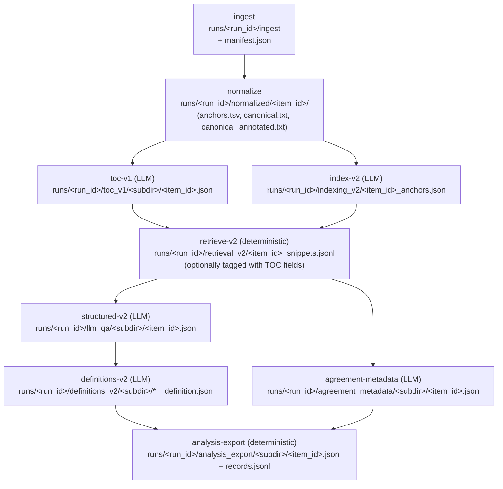

# Pipeline Map (Functional + Artifact-Level)

This document is an **artifact-first map** of how this repo is organized today:
- what each CLI command does
- which stages are deterministic vs LLM-backed
- what each stage consumes/produces under `runs/<run_id>/`
- what depends on what

It is intentionally grounded in the current code + on-disk artifact layout (not aspirational re-org).

## Core contracts (shared across everything)

Source-of-truth concepts (see `METHODOLOGY.md`):
- `run_id`: reproducibility boundary → everything writes under `runs/<run_id>/`
- `item_id`: unit of work (typically one EX-10 exhibit) → most stages operate per item
- `anchor_id`: provenance unit (`A0001`, `A0002`, …) → used to ground outputs back to canonical text

## CLI surface (what exists)

`poetry run pipeline --help` exposes these top-level commands:

**Deterministic (offline) stages**
- `ingest` → extracts exhibit HTML into `runs/<run_id>/ingest/` and writes `runs/<run_id>/manifest.json`
- `normalize` → produces anchored canonical text under `runs/<run_id>/normalized/<item_id>/`
- `retrieve-v2` → builds snippet packs under `runs/<run_id>/retrieval_v2/` (requires `index-v2` outputs)
- `analysis-export` → joins prior artifacts into analysis outputs under `runs/<run_id>/analysis_export/`

**LLM-backed stages (gateway required)**
- `toc-v1` → chunk TOC summaries under `runs/<run_id>/toc_v1/`
- `index-v2` → anchor selection JSON under `runs/<run_id>/indexing_v2/`
- `structured-v2` → prompt-driven extraction JSON under `runs/<run_id>/llm_qa/<subdir>/`
- `definitions-v2` → per-term definition artifacts under `runs/<run_id>/definitions_v2/<subdir>/`
- `facility-fundamentals` → facility separation + key dates under `runs/<run_id>/facility_fundamentals/<subdir>/`
- `agreement-metadata` → parties/roles + facility headline terms under `runs/<run_id>/agreement_metadata/<subdir>/`
- `contract-pricing`, `contract-pricing-v3` → pricing regime compiler artifacts under `runs/<run_id>/contract_pricing/<subdir>/`
- `definitions-compiler-v1`, `blocking-terms-compiler-v1`, `compustat-overlay-v1` → definition graph / overlay stages
- `contractir-v0-2 ...` → mixed: has offline subcommands (`validate`, `merge`, `eval`) and LLM-backed flows (`flow`, `strategy-harness`)

## Stage graph (v2 “all-v2” flow)

The repo’s canonical “v2” end-to-end flow is `pipeline all-v2` (see `src/pipeline/cli/all_v2.py`).

Notes grounded in current implementation:
- `retrieve-v2` will attach TOC metadata only if the manifest indicates `toc-v1` ran (see `src/pipeline/evidence/retrieval_v2.py`).
- The `structured-v2` artifact is stored as JSON under `llm_qa/` (see `src/pipeline/extract/structured_v2.py`).

## Per-stage IO summary (v2)

This is the operational contract each stage follows today (inputs/outputs + manifest fields).

| Stage | Type | Reads | Writes | Manifest fields written |
|---|---|---|---|---|
| `ingest` | deterministic | `data/*.nc.tar.gz` + optional filter spec | `runs/<run_id>/ingest/*.html`, `runs/<run_id>/manifest.json` | `run_id`, `tarballs`, `filters`, `accessions`, `items` (see `src/pipeline/evidence/ingest.py`) |
| `normalize` | deterministic | `runs/<run_id>/ingest/*.html` | `runs/<run_id>/normalized/<item_id>/{canonical.txt, anchors.tsv, canonical_annotated.txt, prompt_view.txt}` | (does not currently add explicit manifest fields beyond `normalized` presence) |
| `toc-v1` | LLM | `normalized/<item_id>/anchors.tsv` + prompt(s) | `runs/<run_id>/toc_v1/<subdir>/<item_id>.json` | `toc_v1_output_subdir`, `toc_v1_item_ids`, prompt paths + hashes (see `src/pipeline/evidence/toc_v1.py`) |
| `index-v2` | LLM (selection) | `normalized/<item_id>/canonical_annotated.txt` + prompt | `runs/<run_id>/indexing_v2/<item_id>_anchors.json` | `indexing_v2_prompt`, `indexing_v2_prompt_sha256` (see `src/pipeline/evidence/indexing_v2.py`) |
| `retrieve-v2` | deterministic (packaging) | `indexing_v2/<item_id>_anchors.json`, `normalized/<item_id>/prompt_view.txt`, optional `toc_v1/<subdir>/<item_id>.json` | `runs/<run_id>/retrieval_v2/<item_id>_snippets.jsonl` | (no manifest update; its output is derived deterministically) |
| `structured-v2` | LLM (extraction) | `retrieval_v2/<item_id>_snippets.jsonl` + prompt | `runs/<run_id>/llm_qa/<subdir>/<item_id>.json` (+ `*.raw.txt` on failure) | `structured_v2_prompt`, `structured_v2_prompt_sha256` (see `src/pipeline/extract/structured_v2.py`) |
| `definitions-v2` | LLM (grounding) | `llm_qa/<subdir>/<item_id>.json`, `normalized/<item_id>/canonical.txt`, `anchors.tsv` + prompt | `runs/<run_id>/definitions_v2/<subdir>/*__definition.json` (+ sidecars) | `definitions_v2_prompt`, `definitions_v2_prompt_sha256`, `definitions_v2_output_subdir` (see `src/pipeline/extract/definitions_v2.py`) |
| `agreement-metadata` | LLM (extraction) | `retrieval_v2/<item_id>_snippets.jsonl` + prompt | `runs/<run_id>/agreement_metadata/<subdir>/<item_id>.json` (+ meta + attempt raw) | `agreement_metadata_prompt`, `agreement_metadata_prompt_sha256`, `agreement_metadata_output_subdir`, `agreement_metadata_categories` (see `src/pipeline/extract/agreement_metadata_v1.py`) |
| `analysis-export` | deterministic (join) | `agreement_metadata/<subdir>/<item_id>.json`, `definitions_v2/<subdir>/*__definition.json`, optional `toc_v1/<subdir>/<item_id>.json` | `runs/<run_id>/analysis_export/<subdir>/<item_id>.json` + `records.jsonl` | `analysis_export_output_subdir`, `analysis_export_agreement_metadata_subdir`, `analysis_export_definitions_v2_subdir` (see `src/pipeline/extract/analysis_export_v1.py`) |

## Where “multiple Q/A parts” show up

The same overall processing (ingest → normalize → evidence packaging) branches into multiple *LLM-backed transforms*:
- **Selection**: `index-v2` reads full annotated doc and selects anchor IDs (evidence selection).
- **Navigation/context**: `toc-v1` builds a chunk TOC to tag snippets with “where in the doc” context.
- **Extraction**: `structured-v2`, `facility-fundamentals`, `agreement-metadata`, `contract-pricing` compile snippet packs into strict-ish artifacts.
- **Grounding**: `definitions-v2` re-asks over tightly scoped contexts to pin down definition language.

This is why you see multiple ask/validate loops: they are different **roles** in the pipeline, not duplicated copies of the same step.

## “Old” vs “New” run layouts (practical)

You may see older runs with:
- `runs/<run_id>/indexing/` and `runs/<run_id>/retrieval/` (legacy v1 layout)

The current v2 layout uses:
- `runs/<run_id>/indexing_v2/` and `runs/<run_id>/retrieval_v2/`

This is intentionally an on-disk distinction: treat these as different “run families”.
This is intentionally an on-disk distinction: treat these as different “run families”.

## Other artifact families / flows (non-`all-v2`)

The repo also supports other “pipelines” that reuse the same `run_id` + artifact contract but target different outputs:

### Contract pricing compiler

Commands:
- `pipeline contract-pricing-flow` (ingest → normalize → contract-pricing)
- `pipeline contract-pricing` / `pipeline contract-pricing-v3` (run on an existing normalized run)

Shape:
- These flows can run **without** `index-v2`/`retrieve-v2` if the prompt/compiler does its own evidence targeting.
- Outputs land in `runs/<run_id>/contract_pricing/<output_subdir>/...` (see `src/pipeline/pricing/contract_pricing.py` and `src/pipeline/pricing/contract_pricing_v3.py`).

### ContractIR v0.2 (pricing kernel)

Command group:
- `pipeline contractir-v0-2 ...`

Mixed behavior:
- Offline: `validate`, `merge`, `eval` operate purely on JSON artifacts.
- LLM-backed: `flow`, `strategy-harness` call the gateway and produce `runs/<run_id>/contractir_v0_2/...` artifacts.

This is the repo’s “computable pricing semantics” artifact family (see `METHODOLOGY.md` section **C**).

## Useful offline check

To quickly inspect what’s present for a run (no gateway calls), check:
- `runs/<run_id>/manifest.json`
- stage directories under `runs/<run_id>/` (e.g., `normalized/`, `indexing_v2/`, `retrieval_v2/`, `llm_qa/`, `definitions_v2/`)
